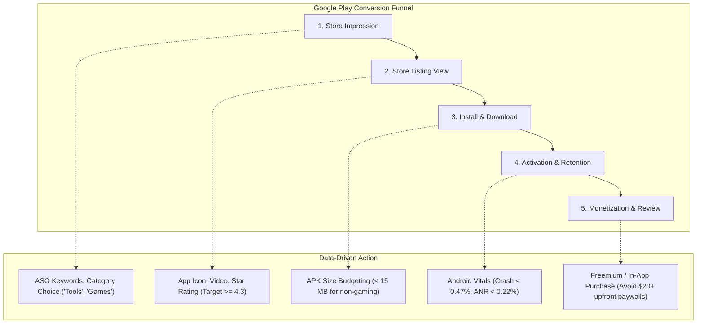

# 📚 Additional Resources & Technical Guide (Python EDA Edition)

**Project**: App Insights Unlocked — Python Exploratory Data Analysis & Market Intelligence  
**Focus**: Python Tooling, Statistical Foundations, Advanced Extensions & Industry References  

---

## 1. Python Data Science & Analytics Stack

To advance beyond exploratory data analysis into automated data pipelines and production ML modeling, leverage the following modern Python ecosystem tools:

### Core Tabular & Numerical Computing
* **Pandas (`>= 2.0`)**: High-performance tabular manipulation utilizing the PyArrow backend for memory-efficient string processing and zero-copy slicing.
  * *Documentation*: [pandas.pydata.org/docs](https://pandas.pydata.org/docs/)
* **Polars & DuckDB**: For multi-million-row scale app store datasets, Polars (Rust-based multi-threaded DataFrame engine) and DuckDB (in-process analytical SQL OLAP database) provide 10–50x speedups over single-core operations.
  * *Polars*: [docs.pola.rs](https://docs.pola.rs/)
  * *DuckDB*: [duckdb.org/docs](https://duckdb.org/docs/)

### Statistical Computing & Hypothesis Testing
* **SciPy (`scipy.stats`)**: Parametric and non-parametric hypothesis testing, probability distributions, kernel density estimations (KDE), and rank correlations (`stats.spearmanr`, `stats.kendalltau`, `stats.mannwhitneyu`).
  * *Documentation*: [docs.scipy.org/doc/scipy/reference/stats.html](https://docs.scipy.org/doc/scipy/reference/stats.html)
* **Statsmodels**: Ordinary Least Squares (OLS) regression, generalized linear models (GLM), time-series seasonal decomposition (STL), and econometric variance diagnostics.
  * *Documentation*: [statsmodels.org/stable](https://www.statsmodels.org/stable/)

### Visualization & Interactive Dashboards
* **Seaborn (`>= 0.13`)**: Statistical data visualization built on Matplotlib, providing elegant interfaces for bivariate distributions, facet grids, and violin plots.
  * *Documentation*: [seaborn.pydata.org](https://seaborn.pydata.org/)
* **Plotly & Bokeh**: Interactive web-based charting engines supporting pan, zoom, hover tooltips, and dynamic cross-filtering.
  * *Documentation*: [plotly.com/python](https://plotly.com/python/)
* **Streamlit**: Rapid creation of interactive Python web dashboards for sharing EDA insights with executive stakeholders without frontend HTML/JS overhead.
  * *Documentation*: [docs.streamlit.io](https://docs.streamlit.io/)

### Natural Language Processing (NLP) & Sentiment Mining
* **TextBlob**: Fast, lightweight sentiment polarity and subjectivity scoring based on pattern-matching lexicons.
  * *Documentation*: [textblob.readthedocs.io](https://textblob.readthedocs.io/)
* **SpaCy & NLTK**: Production-grade tokenization, lemmatization, named entity recognition (NER), and dependency parsing for large user review corpuses.
  * *SpaCy*: [spacy.io](https://spacy.io/)
* **BERTopic & VADER**: Transformer-based neural topic modeling and rule-based sentiment scoring tuned specifically for social and app store review text.
  * *BERTopic*: [maartengr.github.io/BERTopic](https://maartengr.github.io/BERTopic/)

---

## 2. Statistical Methodology & EDA Best Practice Guidelines

When conducting exploratory data analysis on app marketplace datasets, avoid common statistical pitfalls by adhering to these four principles:

### A. Non-Normality and Skewness Correction
App ratings and download counts violate Gaussian assumptions:
* **Ratings**: Heavily left-skewed (negative skew, mass concentrated between 4.0 and 4.6). Always report the **Median** and **Interquartile Range (IQR)** alongside the parametric Mean and Standard Deviation.
* **Installs & Reviews**: Heavily right-skewed (power-law distributions spanning 10 orders of magnitude). Apply logarithmic transformations ($\ln(x + 1)$ or $\log_{10}$) before performing linear regression, correlation analysis, or ANOVA testing.

### B. Handling Small-Sample Bias (The 5-Star Fallacy)
Never rank apps purely by raw average rating. An app with a single 5-star review from the developer's friend is not superior to an app with a 4.6 rating across 5,000,000 reviews. Instead, apply the **Bayesian Average (Shrinkage Estimator)**:

$$R_{\text{Bayesian}} = \frac{C \cdot m + \sum_{i=1}^n r_i}{C + n}$$

Where:
* $m$ = Overall store-wide mean rating ($4.17$)
* $C$ = Confidence threshold (e.g., minimum 100 reviews)
* $n$ = Total reviews for the individual application
* $r_i$ = Individual review ratings

### C. Correlation vs. Causation
The Pearson correlation between Installs and Ratings is $+0.04$. However, binned analysis reveals that apps with over 100M installs average 4.39 stars. This reflects **reverse causality and survival bias**: higher-quality apps survive and receive sustained marketing budgets, while lower-quality apps churn out before reaching large cohorts.

---

## 3. App Store Optimization (ASO) & Growth Framework

Empirical findings from this Python EDA translate directly into actionable mobile engineering and marketing strategies:

### Strategic Rules for Engineering & Product Teams:
1. **APK Size Ceiling**: Maintain non-gaming application downloads under **15 MB**. In bandwidth-constrained markets, install conversion rates drop by 1% for every 6 MB increase in package size.
2. **Review Solicitation Algorithm**: Never display a "Rate This App" prompt immediately upon installation or app launch. Trigger prompts only after a confirmed positive user experience (e.g., 3 consecutive app sessions, or successful completion of a primary in-app workflow).
3. **Android Vitals Guardrails**: Monitor Google Play Console telemetry continuously:
   * Keep user-perceived crash rate $< 0.47\%$.
   * Keep Application Not Responding (ANR) rate $< 0.22\%$.
   * Exceeding these thresholds triggers automated algorithmic demotion in store search and recommendation surfaces.

---

## 4. Advanced Machine Learning Project Extensions

Take this EDA project to the next level by building predictive and NLP models:

### Extension 1: App Success & Rating Prediction
* **Task**: Formulate a supervised regression / classification model to predict whether a newly published app will achieve $\ge 4.3$ stars and $>1\text{M}$ downloads.
* **Feature Engineering**:
  * Category and Content Rating one-hot encoding.
  * Size in MB and Price.
  * Days since last update.
  * Title character length and sentiment of app description.
* **Suggested Algorithms**: `LightGBM`, `XGBoost`, `CatBoost`, or `RandomForestRegressor`.

### Extension 2: Aspect-Based Sentiment Analysis (ABSA)
* **Task**: Deconstruct raw user reviews into specific product feature dimensions:
  * UI/UX Aesthetics
  * Performance & Battery Drain
  * Pricing / Ads Intrusiveness
  * Customer Support & Account Management
* **Suggested Libraries**: `Hugging Face Transformers` (`google/electra-small` or `distilbert-base-uncased-finetuned-sst-2-english`) fine-tuned on Play Store reviews.

### Extension 3: Anomaly & Fraud Detection
* **Task**: Detect bot reviews and fake rating manipulation by flagging apps with unnatural review-to-install ratios ($>10\%$) or anomalous clustering of 5-star reviews within a single 24-hour window.
* **Suggested Techniques**: Isolation Forests, Local Outlier Factor (LOF), and Benford's Law distribution analysis.

---

## 5. Primary References, Data Sources & Official APIs

1. **Dataset Provenance**:
   * Google Play Store Apps Dataset (Kaggle): [kaggle.com/datasets/lava18/google-play-store-apps](https://www.kaggle.com/datasets/lava18/google-play-store-apps)
2. **Google Play Developer Resources**:
   * Google Play Console Guidelines: [developer.android.com/distribute/console](https://developer.android.com/distribute/console)
   * Android Vitals Performance Benchmarks: [developer.android.com/topic/performance/vitals](https://developer.android.com/topic/performance/vitals)
   * Google Play Developer API (Automated Ingestion): [developers.google.com/android-publisher](https://developers.google.com/android-publisher)
3. **Python Scientific Documentation**:
   * Pandas User Guide: [pandas.pydata.org/docs/user_guide](https://pandas.pydata.org/docs/user_guide/)
   * Seaborn Tutorial & Gallery: [seaborn.pydata.org/tutorial.html](https://seaborn.pydata.org/tutorial.html)
   * SciPy Statistical Functions: [docs.scipy.org/doc/scipy/reference/stats.html](https://docs.scipy.org/doc/scipy/reference/stats.html)
4. **Academic & Industry Literature**:
   * Martin, W., et al. (2017). *The App Store Ecosystem: App Store Mining and Analysis*. IEEE Software.
   * Google Play ASO Best Practices Whitepaper: [play.google.com/console/about/guides/grow-your-audience](https://play.google.com/console/about/guides/grow-your-audience/)
