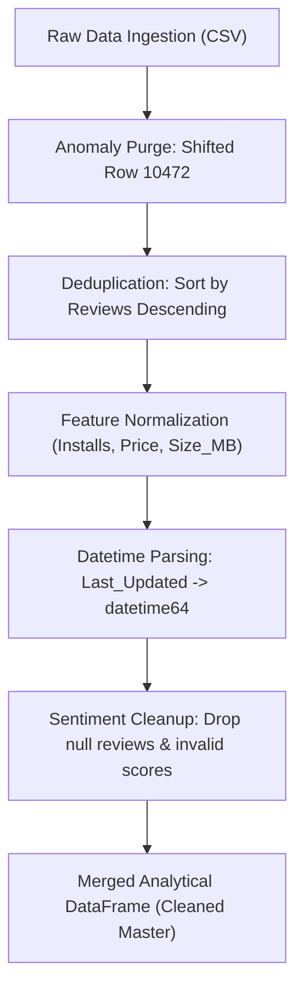

# 📋 Case Study Document: App Insights Unlocked (Python EDA Edition)

---

## 1. Executive Summary & Business Context

Imagine you are a **Lead Data Scientist & Analytics Consultant** working for a mobile technology enterprise specializing in software products for the Android ecosystem. The enterprise has acquired a comprehensive market intelligence dataset from the Google Play Store capturing metadata for over **10,800 applications** across **33 market categories**, alongside **64,000+ qualitative user reviews**.

In the hyper-competitive mobile app economy, launching an application without empirical market validation leads to high customer acquisition costs, poor retention, and low monetization efficiency. To maximize market penetration, user retention, and monetization, executive leadership requires a rigorous, **Python-based Exploratory Data Analysis (EDA)**.

Using Python's data science ecosystem (`pandas`, `numpy`, `matplotlib`, `seaborn`, `scipy`, `statsmodels`, and NLP libraries), your mission is to transform raw, unstructured market telemetry into actionable product, pricing, sizing, and sentiment strategies.

---

## 2. Problem Statement

Your objective is to ingest, clean, explore, statistically evaluate, and visualize the Google Play Store ecosystem using **Python**. You will conduct an end-to-end **Exploratory Data Analysis (EDA)** pipeline to uncover market distributions, pricing elasticity, size-to-install thresholds, update cadence dynamics, and qualitative user sentiment drivers.

The insights generated from this Python EDA will directly resolve four core business challenges:
1. **Product & Portfolio Strategy**: Which categories, genres, and APK feature sizes offer the highest return on engineering investment and lowest market saturation?
2. **Monetization & Pricing Optimization**: What is the quantitative impact of upfront paywalls on download volume, review velocity, and user ratings? What is the optimal pricing threshold?
3. **App Store Optimization (ASO) & Maintenance**: How does update recency influence install velocity and store algorithmic ranking?
4. **Voice of Customer (VoC) Sentiment Mining**: What specific product features, performance flaws, and UX friction points drive negative versus positive user sentiment?

---

## 3. Stakeholder Analysis & Decision Matrix

| Stakeholder Group | Role | Core Analytical Focus | Python EDA Deliverable |
|---|---|---|---|
| **Senior Leadership (C-Suite)** | Chief Executive & Strategy Officers | High-level market share, TAM/SAM, monetization split, category revenue potential. | Macro KPI summaries, distribution visual matrices, strategic market gap heatmaps. |
| **Product Managers (PMs)** | Feature & Roadmap Leads | Category benchmarks, competitive ratings, feature-to-size trade-offs, install tiers. | Binned rating-install curves, category rating boxplots, feature density charts. |
| **Engineering & Tech Leads** | Mobile Architecture & DevOps | APK size budgets, Android OS minimum SDK requirements, update cadence patterns. | Size vs. Installs regression plots, OS version compatibility distributions, update frequency time series. |
| **Growth & Marketing Teams** | User Acquisition (UA) & Brand Leads | Content rating targeting (`Everyone` vs. `Teen`), review velocity, store visibility. | Content rating cross-tabulations, review volume ratios, ASO correlation matrices. |
| **Customer Experience (CX/Support)** | User Research & Quality Assurance | User friction points, bug reporting themes, negative review sentiment polarity. | Sentiment distribution donuts, polarity vs. subjectivity scatterplots, n-gram / word cloud text summaries. |

---

## 4. Comprehensive Data Dictionary

The project utilizes two interconnected relational tables: **Application Metadata** and **Qualitative User Reviews**.

### Table 1: `googleplaystore` (Application Metadata)

| Column Name | Raw Data Type | Cleaned Python Data Type | Description | Sample Values / Range |
|---|---|---|---|---|
| **`App`** | `object` (string) | `str` / `object` | Name of the mobile application (unique entity identifier) | `"Instagram"`, `"Subway Surfers"` |
| **`Category`** | `object` (string) | `category` / `str` | High-level Play Store category classification | `'GAME'`, `'FAMILY'`, `'TOOLS'`, `'COMMUNICATION'` |
| **`Rating`** | `float64` / `object` | `float64` | Average user review score (scale: 1.0 – 5.0) | `4.2`, `4.5`, `np.nan` |
| **`Reviews`** | `object` (string) | `int64` | Total count of user reviews submitted to Google Play | `78158306`, `967`, `0` |
| **`Size`** | `object` (string) | `float64` (in MB) | Installation package size standardized to Megabytes (MB) | `"19M"` $\rightarrow$ `19.0`, `"512k"` $\rightarrow$ `0.5`, `"Varies with device"` $\rightarrow$ `np.nan` |
| **`Installs`** | `object` (string) | `int64` | Minimum milestone download count threshold | `"1,000,000+"` $\rightarrow$ `1000000` |
| **`Type`** | `object` (string) | `category` (`'Free'`, `'Paid'`) | Commercial licensing distribution model | `'Free'`, `'Paid'` |
| **`Price`** | `object` (string) | `float64` | Retail purchase price in US Dollars (USD) | `"$4.99"` $\rightarrow$ `4.99`, `"0"` $\rightarrow$ `0.00` |
| **`Content Rating`** | `object` (string) | `category` | Regulatory age appropriateness classification | `'Everyone'`, `'Teen'`, `'Mature 17+'`, `'Everyone 10+'` |
| **`Genres`** | `object` (string) | `str` / `object` | Detailed sub-category classification (semicolon-delimited) | `'Art & Design'`, `'Action;Pretend Play'` |
| **`Last Updated`** | `object` (string) | `datetime64[ns]` | Timestamp of most recent build published to store | `"January 7, 2018"` $\rightarrow$ `Timestamp('2018-01-07')` |
| **`Current Ver`** | `object` (string) | `str` / `object` | Current application version string published by developer | `"1.0.0"`, `"Varies with device"` |
| **`Android Ver`** | `object` (string) | `str` / `object` | Minimum Android OS version required to run build | `"4.0.3 and up"`, `"Varies with device"` |

---

### Table 2: `googleplaystore_user_reviews` (Qualitative Sentiment)

| Column Name | Raw Data Type | Cleaned Python Data Type | Description | Scale / Values |
|---|---|---|---|---|
| **`App`** | `object` (string) | `str` / `object` | Name of application (Foreign key linking to Table 1) | `"10 Best Foods for You"`, `"Angry Birds Classic"` |
| **`Translated_Review`** | `object` (string) | `str` / `object` | English-translated raw text of the user feedback | Text string of review |
| **`Sentiment`** | `object` (string) | `category` | Classified categorical emotional polarity | `'Positive'`, `'Negative'`, `'Neutral'` |
| **`Sentiment_Polarity`** | `float64` / `object` | `float64` | Quantitative positivity index computed via NLP | `[-1.0, +1.0]` (`-1.0` = max negative, `+1.0` = max positive) |
| **`Sentiment_Subjectivity`** | `float64` / `object` | `float64` | Quantitative objectivity vs. subjectivity index | `[0.0, 1.0]` (`0.0` = purely objective, `1.0` = purely subjective) |

---

## 5. Python Data Cleaning & Preprocessing Pipeline

To prepare the raw datasets for rigorous statistical analysis and visualization, execute the following standardized Pandas pipeline:



### Preprocessing Protocol Specifications:
1. **Shifted Anomaly Dropping (Row index 10472)**: Remove the corrupted record (*"Life Made WI-Fi Touchscreen Photo Frame"*) where values were shifted left due to an omitted category, resulting in `Rating = 19` and invalid types.
2. **Deduplication Strategy**: Multiple entries exist for popular apps scraped at different times. Sort the DataFrame by `Reviews` descending and execute `.drop_duplicates(subset=['App'], keep='first')`. This reduces 10,840 raw entries down to **9,638 unique apps**.
3. **Numerical Parsing & Standardization**:
   * **`Installs`**: Strip `+` and `,` characters using `.str.replace()` and cast to `np.int64`.
   * **`Price`**: Strip `$` using `.str.replace('$', '')` and cast to `np.float64`.
   * **`Size`**: Create `Size_MB` by converting strings ending in `'M'` with $\times 1.0$, strings ending in `'k'`/`'K'` with $/ 1024$, and mapping `'Varies with device'` to `np.nan`.
   * **`Rating`**: Coerce non-numeric and `'NaN'` strings to `np.nan` with `pd.to_numeric(errors='coerce')`.
   * **`Last Updated`**: Convert formatted text to `pd.to_datetime(df['Last Updated'])`.
4. **Sentiment Data Sanitization**: Remove rows where `Translated_Review` or `Sentiment` is null or NaN, yielding **37,427 clean qualitative evaluations**.

---

## 6. Official Challenge Question Bank (25 Questions)

The exploratory analysis is organized across three levels of analytical complexity:

### Category A: Basic-Level Questions (10 Questions)
*Fundamental Descriptive Statistics, Aggregations, & Distributions*
1. **Average Rating**: What is the overall average user rating across all rated apps in the dataset?
2. **Category Breadth**: How many distinct application categories exist in the Google Play ecosystem?
3. **Size Distribution**: What is the parametric and non-parametric distribution of application file sizes (in MB)?
4. **Monetization Breakdown**: What is the exact split and market percentage between Free and Paid apps?
5. **Content Rating Distribution**: What is the most common content rating, and what proportion of the market does it represent?
6. **Top Installed Flagships**: What are the top 5 most installed apps, and how do they rank when broken by review engagement?
7. **Quality Threshold Benchmarking**: How many applications have achieved a rating of 4.0 or above?
8. **Review Velocity by Licensing Model**: What is the comparative mean review count for Free versus Paid applications?
9. **Category Size Profiling**: What is the mean app file size (in MB) across each individual category?
10. **Annual Maintenance Cohort**: How many applications received an update in the calendar year 2018?

---

### Category B: Medium-Level Questions (10 Questions)
*Bivariate Correlations, Slicing, Segmentations, & Comparative Analytics*
11. **Rating vs. Scale Correlation**: What is the Pearson and Spearman correlation between an app's install count and its average rating?
12. **Category Rating Leaderboard**: Which application categories command the highest and lowest average customer ratings?
13. **Price Elasticity & Rating Impact**: How does the purchase price of an app influence its user rating? What are the pricing bracket trends?
14. **Content Rating vs. Satisfaction**: How do user ratings vary across different age/content rating classifications?
15. **Million-Download Hit Generators**: Which specific genres produce the largest volume of blockbuster apps exceeding 1 Million downloads?
16. **Update Recency & Cadence**: How frequently are apps updated, and what is the relationship between update recency and install scale?
17. **APK Size vs. Install Velocity**: What is the empirical impact of application file size on install volume?
18. **Review Giants**: Which apps have amassed the highest number of user reviews, and what are their respective ratings?
19. **Content Rating Split by Monetization**: How does content rating audience distribution differ between Free and Paid apps?
20. **Category Install Dominance**: What are the top 5 market categories by aggregate cumulative downloads?

---

### Category C: Advanced-Level Questions (5 Questions)
*Multivariate Modeling, Longitudinal Trends, NLP Sentiment Mining, & Skewness Diagnostics*
21. **The 5-Star Paradox**: What characterizes the top apps with perfect 5.0 ratings when examining their review counts and install volumes?
22. **Longitudinal Maintenance Trajectory**: Analyze the temporal trend of application updates over time. Are there seasonal spikes or platform policy catalysts?
23. **Binned Install Progression**: How does the average rating evolve as an application scales from early launch ($<10\text{k}$) to global ubiquity ($1\text{B}+$)?
24. **Qualitative NLP Sentiment Mining**: What is the distribution of sentiment polarity and subjectivity in user reviews? What core complaint themes differentiate low-rated apps from high-rated ones?
25. **Mean vs. Median Genre Robustness**: Compare the parametric mean versus non-parametric median ratings across genres to diagnose skewness and outlier vulnerability.

---

## 7. Python Scientific Stack & Execution Environment

To execute this case study and reproduce all analytical findings, configure the following Python environment:

```python
# Required Python Libraries
import numpy as np               # Vectorized numerical operations
import pandas as pd              # Data wrangling, cleaning & tabular aggregation
import matplotlib.pyplot as plt  # Core publication-quality plotting engine
import seaborn as sns            # Statistical data visualization & styling
from scipy import stats          # Parametric & non-parametric statistical tests
import statsmodels.api as sm     # Regression & time-series analysis
from wordcloud import WordCloud  # Text visualization for NLP reviews
import re                        # Regular expressions for text processing
```

All analysis should adhere to PEP 8 standards, vectorization over iterative looping, and reproducible seed initialization where stochastic algorithms are employed.
