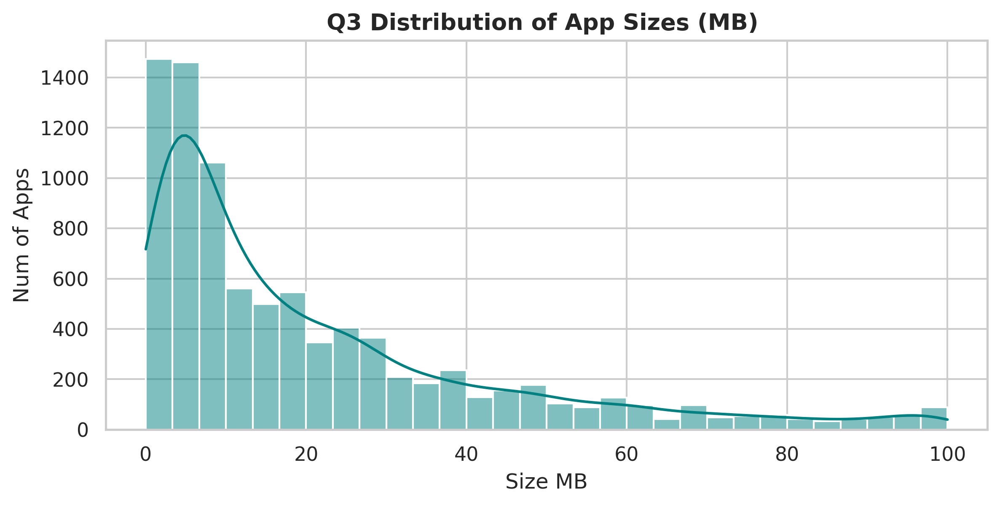

# App-Insights-Analysis- Google Play Store
## Project Overview
This project performs an end-to-end Exploratory Data Analysis (EDA) on the Google Play Store dataset to uncover key factors influencing app ratings, install volumes, pricing viability, and update cadences.

## Tech Stack & Libraries
- Python
- Pandas & NumPy (Data Cleaning, Transformation & Grouped Aggregations)
- Matplotlib & Seaborn (Statistical Visualizations)

## Key Insights & Findings
1. **Catalog Benchmarks:** The platform-wide average rating is ~4.19/5.0, with Free apps accounting for over 90% of total listings.
2. **Correlation Analysis:** Pearson correlation between Installs and Ratings is near-zero (~0.05), proving that scale and user satisfaction operate independently.
3. **Monetization & Pricing:** Apps priced between $1.00 and $5.00 maintain steady rating averages, whereas apps above $50.00 exhibit sharp rating declines due to heightened user expectations.
4. **Maintenance Impact:** More than 70% of active apps received updates in 2018, demonstrating a strong link between active maintenance and store visibility.
5. **Genre Benchmarks:** Specialized categories (e.g., Comics, Education) sustain higher median satisfaction scores than high-friction casual categories.

## Visualizations

### App Update Volume Trend (2016 - 2018)
.png)

### App Rating Distribution by Install Tier

### Highest vs Lowest Rated Genres
.png)

### Size vs Installs

### Top 5 Categories by Total Installs
.png)

### App Size Distribution

